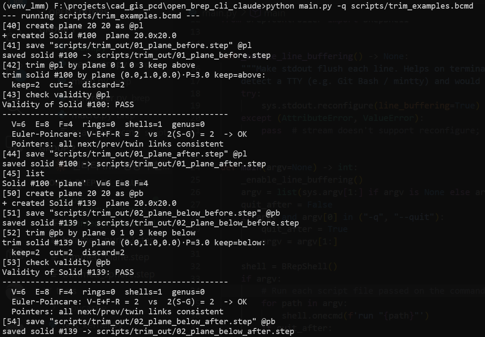
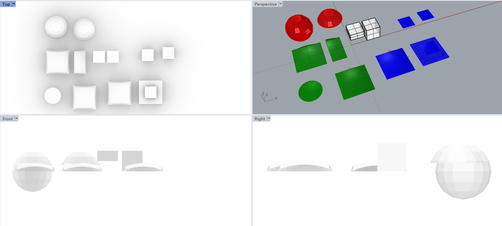
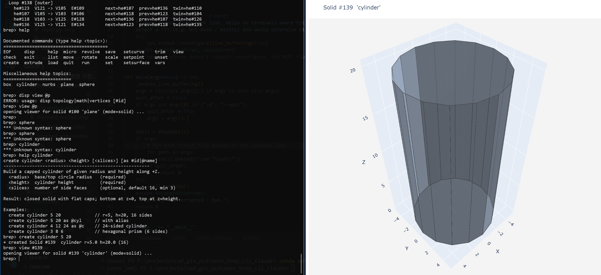
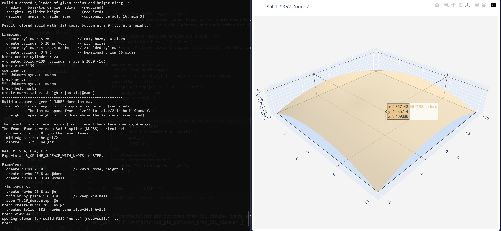
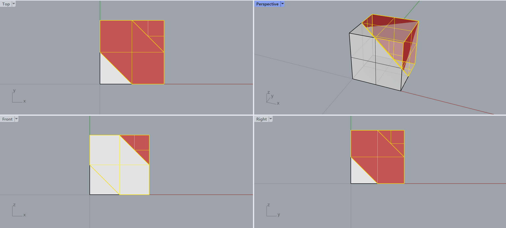
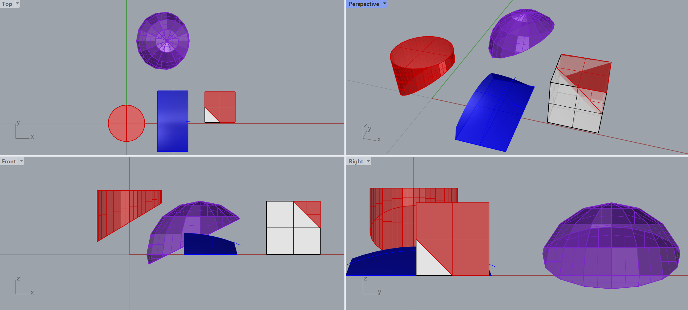
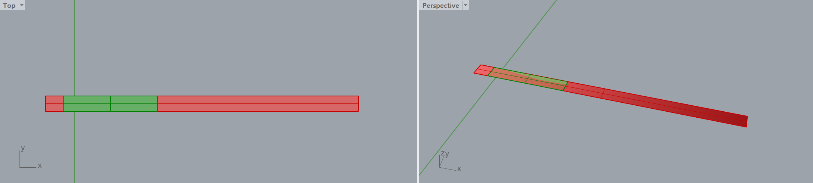
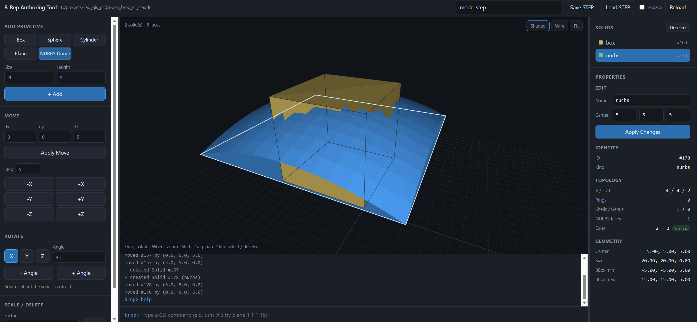

# Advanced CLI B-Rep Kernel Modeler

A text-driven solid modeling engine built **from scratch** (no OpenCascade or any
external CAD library) for CAD research and education. It implements a Boundary
Representation (B-Rep) kernel on a pure half-edge data structure, manipulated only
through atomic **Euler operators**, with a clean MVC separation between topology,
geometry, high-level modeling and the CLI.

<p align="center">
</img>
</img> </br>
</img>
</img> </br>
</img>
</img>
</img>
</img>
</p>


## Why this exists

Most CAD tutorials either hand-wave the kernel or hide it behind a giant library.
This project keeps the kernel small enough to read end-to-end while staying
topologically rigorous: every operation preserves the Euler–Poincaré invariant

```
V - E + F - R = 2 (S - G)
```

and the validator checks it (plus half-edge pointer consistency) on demand.

## Architecture (strict MVC, layered Model)

```
brep/
  geometry.py    Layer 2  Point3D, Bezier, NURBSSurface, TrimPlane, curve/surface intersection, affine transforms (numpy)
  topology.py    Layer 1  Half-edge entities: Vertex / HalfEdge / Edge / Loop / Face / Solid
  euler_ops.py   Layer 1  Micro Euler operators (mvfs/kvfs-, mev/kev, mef/kef, kemr/mekr, kfmr/mfkr, split_edge)
  macro.py       Layer 3  Macro modeling: extrude, revolve, trim (plane/surface), extend, intersect, blend, primitives
  mesh.py        Layer 3  Build a valid half-edge solid from a polygon mesh (sphere/cylinder)
  registry.py    Layer 4  Centralized immutable #id symbol table
  model.py                Kernel: owns the registry + all solids (the "Model")
  xform.py       Layer 3  Whole-entity transforms (topology + attached geometry move together)
  validate.py             Euler-Poincare + pointer integrity checks
  view.py        View     Tabular / tree console formatting
  viewer.py      View     3-D interactive viewer (plotly → vedo → tkinter)
  controller.py  Controller  REPL + batch runner (cmd / shlex)
  webapp.py      Controller  Authoring web app: stdlib HTTP server on the live shell
  web/                     Its front-end (index.html / app.js / styles.css) — no CDN, no build step
  stepio.py      I/O      STEP (ISO 10303-21) export / import (rebuilds half-edge topology)
main.py                   Entry point
tests/test_kernel.py         Regression tests (assert Euler invariant on many shapes)
tests/test_step_roundtrip.py STEP save→load topology round-trip + web app API tests
scripts/*.bcmd            Example batch command scripts
```

The dependency direction is one-way: Controller → (macro → euler_ops → topology),
geometry, view, validate. Topology never imports geometry's math, and the View
never mutates anything.

## Requirements

* Python 3.10+
* `numpy` (linear algebra and surface evaluation)
* `plotly` (3-D interactive viewer — browser-based, **no numpy required**) — primary viewer
* `vedo` (optional, VTK window) — requires working numpy
* `matplotlib` (optional, fallback wireframe)

```powershell
pip install -r requirements.txt
```

## Running

Interactive REPL:

```powershell
python main.py
```

Run a batch script and drop into the REPL, or run-and-quit with `-q`:

```powershell
python main.py scripts/box.bcmd
python main.py -q scripts/box.bcmd
```

Open the authoring web app (also available as `webapp` at the prompt):

```powershell
python main.py --web          # http://127.0.0.1:8765/, then the REPL
python main.py --web 9000     # on a specific port
```

Run the test suite:

```powershell
python tests/test_kernel.py
python tests/test_step_roundtrip.py
```

## Quick start

```
brep> create box 10 20 30 as #1
brep> check validity #1
Validity of Solid #1: PASS
  V=8  E=12  F=6  rings=0  shells=1  genus=0
  Euler-Poincare: V-E+F-R = 2  vs  2(S-G) = 2  -> OK
brep> disp topology #1
brep> view @b                    // open 3-D viewer in browser
brep> save "box.step" #1
```

Or build the same box one atomic Euler operator at a time
(each command prints the `#id`s it creates):

```
brep> micro mvfs 0 0 0
brep> micro mev #103 10 0 0
brep> micro mev #105 10 10 0
brep> micro mev #108 0 10 0
brep> micro mef #112 #103
brep> extrude #119 0 0 5
```

## Referring to entities

Macros create many entities whose auto-ids are hard to predict, so three
reference forms are accepted **anywhere a `#id` is expected**:

| Form                                                           | Meaning                                                       |
| -------------------------------------------------------------- | ------------------------------------------------------------- |
| `#100` / `100`                                             | a literal id                                                  |
| `@name`                                                      | a user alias, bound with`as @name` or `set @name <token>` |
| `$solid` `$vertex` `$edge` `$face` `$loop` `$last` | the most recently created entity of that kind                 |

The `as` clause on `mvfs`/`mev`/`mef`/`create` accepts either `#id` (request a
specific id) or `@name` (alias the primary entity it makes: solid / edge / face).
`set @name <token>` aliases any existing entity; `vars` lists current aliases and
`$last` values; `unset @name` removes an alias.

```
micro mvfs 0 0 0
set @v0 $vertex          // capture the seed vertex
micro mev $vertex 10 0 0 // grow from the latest vertex each step
micro mev $vertex 10 10 0
micro mev $vertex 0 10 0
micro mef $vertex @v0    // close back to v0
extrude $face 0 0 5      // sweep the face MEF just created
```

This is exactly `scripts/manual_box.bcmd` — it contains no hardcoded ids.

## Command reference

IDs are written with a leading hash, e.g. `#100`. New entities get the next free
id automatically; `as #<id>` requests a specific one, `as @name` aliases it.

In the REPL, `help <topic>` shows detailed usage for any command or primitive.
For example: `help plane`, `help box`, `help trim`, `help create`.

### Micro topology (`micro`)

| Command                                        | Meaning                                        |
| ---------------------------------------------- | ---------------------------------------------- |
| `micro mvfs <x> <y> <z> [as #id]`            | Make Vertex Face Solid – seed a solid         |
| `micro mev #<vertex> <x> <y> <z> [as #edge]` | Make Edge Vertex – grow a wire                |
| `micro mef #<v1> #<v2> [as #face]`           | Make Edge Face – close a loop into a new face |
| `micro kev #<edge>`                          | Kill Edge Vertex – remove a spike + its tip (inverse of mev) |
| `micro kef #<edge>`                          | Kill Edge Face – merge the two faces across an edge (inverse of mef) |
| `micro semv #<edge> <x> <y> <z>`             | Split Edge Make Vertex – insert a vertex on an edge |
| `micro kemr #<edge>`                         | Kill Edge Make Ring – detach a cycle into an inner ring |
| `micro mekr #<v_outer> #<v_ring>`            | Make Edge Kill Ring – bridge a ring back to the outer loop |
| `micro kfmr #<face>`                         | Kill Face Make Ring – open a handle (genus+1) |
| `micro mfkr #<loop>`                         | Make Face Kill Ring – close a handle (genus−1) |

The full Mäntylä operator set is exposed, each op reporting its ΔEuler; the
make/kill pairs are exact inverses, so any construction can be undone step by
step (`help micro`).

### Macro modeling

All `create` commands require explicit size parameters. Use `help <kind>` for
parameter details and examples.

| Command                                                          | Required params          | Optional                     | Meaning                                                                                                                                                                                             |
| ---------------------------------------------------------------- | ------------------------ | ---------------------------- | --------------------------------------------------------------------------------------------------------------------------------------------------------------------------------------------------- |
| `create box <L> <W> <H>`                                       | L, W, H                  | `[as #id\|@name]`           | axis-aligned box (V=8 E=12 F=6)                                                                                                                                                                     |
| `create sphere <r>`                                            | radius                   | `[slices stacks]` `[as]` | faceted UV sphere                                                                                                                                                                                   |
| `create cylinder <r> <h>`                                      | radius, height           | `[slices]` `[as]`        | capped cylinder                                                                                                                                                                                     |
| `create nurbs <size> <height>`                                 | side length, apex height | `[as]`                     | degree-2 NURBS dome lamina (V=4 E=4 F=2)                                                                                                                                                            |
| `create plane <W> <H>`                                         | width, height            | `[as]`                     | flat rectangular lamina (V=4 E=4 F=2)                                                                                                                                                               |
| `extrude #<face> <dx> <dy> <dz>`                               | face, direction vector   | —                           | sweep face into a prism                                                                                                                                                                             |
| `revolve #<face> <x\|y\|z> <angle>`                              | face, axis, degrees      | `[segments]`               | faceted rotational sweep                                                                                                                                                                            |
| `trim curve #<edge> at <u>`                                    | edge, u∈(0,1)           | —                           | split edge at parameter u (keeps both halves)                                                                                                                                                       |
| `trim surface #<face> keep <u0> <u1> <v0> <v1>`                | face, uv window          | —                           | crop a NURBS face to the kept parametric window                                                                                                                                                     |
| `trim surface #<face> by #<loop>`                              | face, loop id            | —                           | legacy: tag a trim-boundary id (metadata only, no geometry change)                                                                                                                                  |
| `trim #<solid> by plane <nx> <ny> <nz> <d>`                    | solid, plane eq          | `[keep above\|below]`       | geometry-aware half-space cut of any solid (lamina/box/sphere/cylinder/nurbs); cuts edges on their real curve and faces on their real surface;`keep` picks the surviving side (default `above`) |
| `trim #<solid> by surface #<face>`                             | solid, cutter face       | `[keep above\|below]`       | trim with a **curved NURBS cutter** (NURBS ∩ NURBS): the cutter surface acts as a signed-distance field; crossing edges bisected onto the curved tool, straddling faces MEF-cut; `above` = the cutter-normal side |
| `extend #<edge> to plane <nx> <ny> <nz> <d>` \| `to #<face>` | edge, target             | —                           | extend a curve along its tangent until it meets the target (plane / face-plane / NURBS surface); appends a vertex+edge on the contact point                                                         |
| `extend #<face> to plane <nx> <ny> <nz> <d>` \| `to #<face>` | face, target             | `[along <dx> <dy> <dz>]`   | sweep a planar sheet up to the target (extrude-to-target); the new cap lies on the target — flat for a plane, conforming for a NURBS surface                                                       |
| `intersect #<faceA> #<faceB>`                                  | two NURBS faces          | `[samples <n>]` `[as]`     | **NURBS ∩ NURBS** intersection curve lifted into the model as a wire solid; every vertex stores `(u,v)` on *both* surfaces (the classic three-representation form)                                  |
| `blend #<faceA> #<faceB> width <w>`                            | two NURBS faces, width   | `[samples <n>]` `[as]`     | **curvature-continuous (G2) blend patch** across the intersection: quintic Hermite cross-sections matching position + 1st + 2nd derivative on both rails                                            |
| `delete #<solid>`                                              | solid                    | —                           | remove a solid and everything it owns (aliases into it are unbound)                                                                                                                                  |

### Geometry & editing

| Command                                          | Meaning               |
| ------------------------------------------------ | --------------------- |
| `setpoint #<vertex> as (<x>, <y>, <z>)`        | update coordinates    |
| `setcurve #<edge> as bezier #<cp1> ... #<cpN>` | attach a Bezier curve |
| `setsurface #<face> as nurbs <deg_u> <deg_v>`  | attach a NURBS patch  |

### Transforms

| Command                              | Meaning                          |
| ------------------------------------ | -------------------------------- |
| `move #<entity> <dx> <dy> <dz>`    | translate                        |
| `rotate #<entity> <x\|y\|z> <angle>` | rotate about a principal axis    |
| `scale #<entity> <factor>`         | uniform scale about the centroid |

### Query, I/O & Viewer

| Command                            | Meaning                                                |
| ---------------------------------- | ------------------------------------------------------ |
| `view [solid\|wire\|points] [#id]` | **3-D interactive viewer** (browser/VTK/tkinter) |
| `disp topology [#id]`            | full half-edge pointer tree                            |
| `disp math #<id>`                | underlying equations / control points                  |
| `disp vertices [#id]`            | coordinate table                                       |
| `check validity [#id]`           | Euler + pointer check → PASS / FAIL                   |
| `set @<name> <token>`            | bind a symbolic name to an entity                      |
| `unset @<name>`                  | remove a symbolic name                                 |
| `vars`                           | list aliases and`$last` entities                     |
| `list`                           | summarize all solids                                   |
| `run "<script>"`                 | execute commands from a file                           |
| `save "<file.step>" [#solid\|all]` | export STEP (AP203 manifold B-rep); `all` writes every solid |
| `load "<file.step>" [points]`    | import STEP **as half-edge solids**; `points` for a vertex cloud |
| `webapp [port] [nobrowser]`      | open the authoring web app on this session             |
| `exit` / `quit`                | leave the REPL                                         |

In scripts, blank lines and lines starting with `#` or `//` are comments. `//`
also starts an inline comment (`#` cannot, since it collides with `#id`s).

## Authoring web app

`webapp` starts a small stdlib HTTP server (loopback only — it runs kernel
commands) and opens a browser front-end **bound to the live REPL session**: one
Kernel, one id registry, one alias table. A box added in the browser appears in
`list` at the prompt; `trim @b by plane 1 1 1 15` typed at the prompt changes
what the canvas draws on the next refresh. That sharing is the point — it makes
B-Rep operations something you can watch while you test them.

```
brep> webapp
web app serving at http://127.0.0.1:8765/
```

| Pane       | Contents                                                                      |
| ---------- | ----------------------------------------------------------------------------- |
| **left**   | add box / sphere / cylinder / plane / NURBS dome; move (fields + ±X/±Y/±Z nudge), rotate about the shape's own centroid, scale, delete |
| **centre** | interactive canvas — drag rotate, wheel zoom, shift+drag pan, click to select — over a console that runs any CLI command |
| **right**  | the selected solid's `#id`, V/E/F, rings, shells, genus, live Euler check, bounding box and centroid |
| **top**    | STEP save / load (`교체` replaces the scene instead of merging)                |

The front-end is a single dependency-free `canvas` renderer: the server
tessellates each face (NURBS surfaces are sampled on a 14×14 grid) and the
browser projects, depth-sorts and shades the triangles itself. No CDN, no npm,
no build step.

### Round-tripping through STEP

The web app's save/load buttons write and read the same files the CLI's `save`
and `load` use, so a shape authored in the browser comes back as **real half-edge
topology** you can trim, blend, transform and validate:

```
brep> webapp                      // author a box + dome, press "STEP 저장"
brep> load "model.step"
loaded 2 solid(s) from model.step:
  Solid #157 'box'    V=8 E=12 F=6
  Solid #178 'nurbs'  V=4 E=4  F=2
brep> check validity #157         // PASS
brep> trim #157 by plane 1 1 1 15
```

`load` resolves `ADVANCED_FACE → FACE_BOUND → EDGE_LOOP → ORIENTED_EDGE →
EDGE_CURVE → VERTEX_POINT → CARTESIAN_POINT` to recover each face's boundary
vertex ring, then rebuilds the half-edge graph (edges, mates, loops) from those
rings, merging vertices by coordinate to 1e-6. `B_SPLINE_SURFACE_WITH_KNOTS`
records are re-attached to their faces, so a NURBS dome returns curved rather
than faceted.

## Example gallery

`scripts/examples.bcmd` builds a cube, sphere, cylinder and NURBS dome, validates
each, and exports them to STEP under `scripts/out/`:

```powershell
python main.py -q scripts/examples.bcmd
```

```
create box 10 10 10 as @cube             -> V=8   E=12  F=6
create sphere 5 24 12 as @sphere         -> V=266 E=552 F=288
create cylinder 4 12 24 as @cyl          -> V=48  E=72  F=26
create nurbs 10 4 as @srf                -> V=4   E=4   F=2  (B-spline surface)
create plane 20 20 as @pl                -> V=4   E=4   F=2  (flat lamina)
```

### 3-D Viewer

The `view` command opens an interactive 3-D viewer.  Backend is auto-detected:

| Backend                    | Install                | Viewer type                                 |
| -------------------------- | ---------------------- | ------------------------------------------- |
| **plotly** (default) | `pip install plotly` | Browser HTML — interactive rotate/zoom/pan |
| **vedo**             | `pip install vedo`   | Native VTK window                           |
| **tkinter**          | stdlib (built-in)      | Perspective wireframe fallback              |

```
brep> create box 10 20 30 as @b
brep> view @b                     // shaded faces + edges (default)
brep> view wire @b                // wireframe only
brep> view points @b              // vertex cloud

brep> create nurbs 20 8 as @nd
brep> trim @nd by plane 1 0 0 0   // topological trim
brep> view @nd                    // NURBS keep-half shown as sampled mesh

brep> create sphere 10 as @sp
brep> view wire @sp               // 128-face sphere wireframe
```

NURBS faces are rendered as a 14×14 sampled surface mesh (orange) alongside
the flat topology faces (blue), so the curved geometry is always visible.

Type `help view` in the REPL for the full reference.

### Trim examples (`scripts/trim_examples.bcmd`)

`scripts/trim_examples.bcmd` runs eight self-contained cases. Each saves a
`NN_<name>_before.step` and a `NN_<name>_after.step` into `scripts/trim_out/`, so
you can open the pair side by side and see exactly what the trim removed:

```powershell
python main.py -q scripts/trim_examples.bcmd
```

Trim is **geometry-aware**: B-Rep carries topology *and* geometry
(`Edge.curve`, `Face.surface`, `Vertex.point`), and a plane cut updates both.
Three regimes result, all of which keep the in-memory topology a valid closed
manifold (so `check validity` passes after every trim) while dropping the discard
half only at export time:

Position the plane so it slices *through* the solid — perpendicular or oblique,
not parallel to a face or grazing it — so the intersection is real and visible.

**1 — Straight/flat topological cut** (plane lamina, box, sphere, cylinder).
`split_edge` inserts the exact intersection vertex on each crossing edge and MEF
splits every straddling face into keep/discard halves. STEP emits
`OPEN_SHELL` + `SHELL_BASED_SURFACE_MODEL` (shell entity referenced per
ISO 10303-42):

```
create box 10 10 10 as @bx
trim @bx by plane 1 1 1 15 keep above     // OBLIQUE cut: lops off the far corner at an angle

create cylinder 6 12 24 as @cy
trim @cy by plane -0.6 0 1 6 keep above   // SLANTED cut z=0.6x+6 -> elliptical top

create sphere 10 as @sp
trim @sp by plane -0.5 0 1 3 keep above    // tilted, off-axis cap (128 -> 64 faces)
```

**2 — Analytic curved cut, boundary crosses** (NURBS dome cut vertically).
The flat boundary *does* cross the plane, so the keep face is MEF-cut and its
NURBS surface is **reparameterized** by De Casteljau subdivision — it still
exports as an analytic `B_SPLINE_SURFACE_WITH_KNOTS` spanning only the keep half:

```
create nurbs 20 8 as @nv
trim @nv by plane 1 0 0 0 keep above      // keep x>0
disp math $face                            // control net cropped to x=[0,10]
save "scripts/trim_out/06_nurbs_vertical_after.step" @nv   // OPEN_SHELL + B_SPLINE_SURFACE
```

**3 — Geometry-aware curved cut, only the surface crosses** (NURBS cap cut).
The dome is a flat lamina (every corner vertex at z=0) carrying a surface that
rises to z≈4. A horizontal plane crosses **no topological edge**, so a
polygon-only trim would miss it entirely. The trim extracts the section curve in
the surface's own `(u,v)` parameter space (marching squares over the signed
distance, each point bisection-refined onto the true surface), then **lifts it
into the topology**: a bridge MEV + MEV chain + MEF + KEMR sequence inserts the
section as a real loop of vertices/edges — a new *cap face* bounded by it and an
*inner ring* on the remaining half — so the trim boundary is traversable through
the half-edge structure and the Euler invariant still holds
(`V − E + F − R = 2`). Every section vertex stores its surface parameters in
`vertex.on_surface_uv`. The discard half is flagged; the keep half exports as a
faceted `OPEN_SHELL` following the section:

```
create nurbs 20 8 as @cap
trim @cap by plane 0 0 1 3 keep above      // slice the curved cap at z=3
disp math $face                            // "kept +side, faceted along the intersection"
save "scripts/trim_out/07_nurbs_cap_after.step" @cap   // OPEN_SHELL of keep-side triangles
```

An edge that carries a **Bezier curve** is likewise cut on the *curve*: the split
vertex lands on the curve (where it actually meets the plane), not on the
straight chord between its endpoints, and each half keeps its own sub-curve.

**Parametric fallback**: only when the plane *entirely misses* the solid (no edge
and no surface crosses) does the trim store `face.trim_plane` / `face.trim_section`
metadata instead of changing topology; `disp math #<face>` reports the boundary.

**Non-plane trims**: `trim surface #<face> keep <u0> <u1> <v0> <v1>` resizes a
NURBS face to a parametric window (surface is genuinely cropped, still analytic);
`trim curve #<edge> at <u>` splits an edge at `u`, keeping both halves.

Spheres and cylinders are assembled from a polygon mesh via
`brep/mesh.py::build_solid_from_faces` (a closed, consistently-wound manifold),
then pass the same Euler/pointer validation as the Euler-operator shapes.

### Extend examples (`scripts/extend_examples.bcmd`)

`extend` grows a **source** entity until it reaches a **target**, reusing the
same shared intersection layer as trim: line–plane contacts are closed-form,
and surface contacts are **numerically refined** — a tessellation hit seeds a
Newton-style iteration (closest-point projection using the surface tangent
vectors ∂S/∂u, ∂S/∂v, per Beer's Algorithms 2–3) so the contact lies on the
*true* surface, not on a facet, and carries its parametric address
(`vertex.on_surface_uv = (u, v)`; shown by `disp math #<vertex>`). Both geometry
(the new point *on* the target) and topology (a new vertex/edge, or a swept
strip of faces) are updated. Source and target must be arranged so the extension
path actually **crosses** the target (a right angle or an oblique angle); a
parallel target is never reached, or gives only a trivial offset. Four
source→target combinations are demonstrated; each saves a before/after pair into
`scripts/extend_out/`:

```powershell
python main.py -q scripts/extend_examples.bcmd
```

**Curve → target** (`extend #<edge> to …`): a ray is cast from the edge end along
its tangent, met with the target, and a vertex+edge is appended on the contact
point (Euler +1V +1E). The end whose forward tangent reaches the target is chosen
automatically.

```
// curve -> plane: a wire grows +x into the perpendicular wall x=20
micro mvfs 0 0 0 as @w
micro mev $vertex 6 0 0
extend $edge to plane 1 0 0 20         // hits the wall head-on at (20,0,0)

// curve -> nurbs: a wire below a dome rises +z onto its surface
create nurbs 20 8 as @dome
set @df $face                          // capture the dome's NURBS face
micro mvfs 0 0 -6 as @wire
micro mev $vertex 0 0 -3
extend $edge to @df                    // lands on the dome apex (0,0,4)
```

**Plane → target** (`extend #<face> to …`): the sheet is swept up to the target —
every boundary vertex travels along the sweep direction (default: the face
normal, auto-flipped toward the target) until it meets the target, and side faces
are spun out with MEF, exactly like `extrude` but stopping *on* the target.
Against a **slanted** plane the cap is a ramp; against a NURBS surface each vertex
stops on the surface, so the cap conforms.

```
// plane -> plane: sweep a sheet onto a SLANTED plane -> the cap is a ramp
create plane 20 20 as @s
extend $face to plane -0.5 0 1 10      // z = 10 + 0.5x, not parallel: corners reach z=5..15

// plane -> nurbs: grow a sheet up onto a dome; the cap conforms to the curve
create nurbs 20 8 as @dome
set @df $face
create plane 12 12 as @sheet
move @sheet 0 0 -3
extend $face to @df
```

`extend` never distorts existing geometry — it only appends, so the Euler
invariant is preserved and `check validity` passes after every extend. Type
`help extend` in the REPL for the full reference.

### NURBS ∩ NURBS, curved-cutter trim, G2 blend (`scripts/ssi_blend_examples.bcmd`)

```powershell
python main.py -q scripts/ssi_blend_examples.bcmd
```

All three build on one setup: dome A (apex z=4) and a second dome rotated
180° about x into a **bowl** and lifted to z=5, so the two surfaces cross in a
closed loop (`move`/`rotate` transform the NURBS control nets together with the
vertices, so geometry and topology stay in sync):

```
create nurbs 20 8 as @a
set @fa $face
create nurbs 20 8 as @b
set @fb $face
rotate @b x 180
move @b 0 0 5
```

**`intersect @fa @fb as @c`** — surface B becomes a signed-distance field over
A's `(u,v)` grid (closest-point projection + normal sign); the zero set is
marched in A's parameter space, bisection-refined on the true surface, and each
point tightened onto the exact intersection by **alternating projections**
between both surfaces (residuals ~1e-13 on *both*). The curve is lifted into
the model as a wire solid in the classic **three representations**: the 3D
polyline itself, `(u,v)` on A (`vertex.on_surface_uv`) and `(u,v)` on B
(`vertex.on_surface_uv_b`), all visible via `disp math`.

**`trim @bx by surface @fa keep below`** — the dome surface itself is the
cutting tool (a `SurfaceCutter` duck-typed like `TrimPlane`), so the *entire*
plane-trim pipeline runs unchanged against a curved cutter: crossing box edges
are **bisected onto the curved surface** (split vertices land on it to ~1e-10),
straddling faces MEF-cut, and each cut edge is **refined into a section
polyline** that follows the true curved intersection (alternating projections
between the cutter surface and the face plane; sagitta ~0.01 vs ~0.32 for a
single chord). Two NURBS laminas whose overlap contains the whole closed
intersection loop (`trim @a2 by surface @fb2`) get the loop lifted in as a cap
face + inner ring. Place the shapes so the crossing region is **fully covered
by both** — a partially overlapping target clips the intersection curve and
leaves the trim incomplete. `keep above` means the cutter-normal side.

**`blend @fa @fb width 1.5 as @bl`** — a **curvature-continuous (G2) blend
patch** across the intersection: rails are offset `width` from the curve on
each surface (in-surface, perpendicular to the curve), the cross-boundary walk
is differentiated on the true surface (1st + 2nd directional derivatives), and
each cross-section is a **quintic Hermite** span matching position, first *and*
second derivative at both rails. Control rows are then solved so the patch
**interpolates** every sampled section (basis-matrix solve — the fit step of
the standard NURBS toolkit), and the strip is attached to a lamina solid,
viewable and STEP-exportable like any other NURBS face.

### Analytic trimmed B-splines in STEP (pcurves)

A trimmed NURBS face now exports **analytically by default**: one
`ADVANCED_FACE` carrying the full `B_SPLINE_SURFACE_WITH_KNOTS`, bounded by its
topological loops, where every boundary edge is a `SURFACE_CURVE` pairing the
3D chord with a **`PCURVE`** — a degree-1 B-spline in the surface's `(u,v)`
parameter space inside a `DEFINITIONAL_REPRESENTATION` (ISO 10303-42). This is
the standard pcurve representation of a trimmed surface, made possible because
the trim stores every section vertex's `(u,v)` in the topology. For viewers
with weak pcurve support, `save "<file>" [#solid] faceted` emits the kept side
as a triangle shell instead.

## Verified results

`tests/test_kernel.py` builds boxes, triangular and pentagonal prisms (via both
the macro pipeline and raw Euler operators), a UV sphere, a cylinder and a NURBS
dome, exercises Bezier evaluation/splitting and KEF (the inverse of MEF), and
asserts `V - E + F - R = 2` with no dangling pointers on every shape. The trim
suite covers a lamina plane cut, `keep above`/`keep below`, a NURBS surface-region
crop, the **NURBS cap cut** (the section becomes a real topological ring: 24
vertices/edges traversable through the half-edge structure, each vertex on the
plane *and* on the surface at its stored `(u,v)`), and a **curved edge cut** (a
Bezier edge is split *on the curve* at z=3, never on its chord). The numerical
intersection layer is tested directly: closest-point projection lands exactly on
the dome apex, ray–surface contacts sit on the true surface to <1e-9 (facet-only
accuracy was ~3e-3), and the plane section extracts as one closed parametric
loop. The extend suite verifies contacts on plane and surface targets, the
stored `(u,v)` parameters, and the swept conforming cap. The NURBS ∩ NURBS
suite checks the SSI wire against *both* surfaces (residuals ~1e-13), the
curved-cutter trim (split vertices on the cutter to ~1e-10), the G2 blend
(rails interpolated at every station, cross-tangent in the host tangent
plane), the analytic pcurve STEP export (one trimmed `ADVANCED_FACE`, 24
`PCURVE`s, faceted fallback), KEV as the exact inverse of MEV, and that
`move`/`rotate` transform the NURBS control nets together with the topology.

`tests/test_step_roundtrip.py` closes the loop on I/O: box, sphere, cylinder and
plane survive `save → load` with identical V/E/F and a passing Euler + pointer
check; a restored NURBS dome evaluates to the same `S(u,v)` as the original at
its corners and apex; a trimmed lamina comes back with only its keep half; and
the web app's create / transform / console / save / load / delete endpoints are
driven against a live server, asserting they all mutate the one shared kernel.

## Scope & limitations

This is a teaching kernel, deliberately small:

* **Ring/cavity operators** (`kemr`/`mekr`, `kfmr`/`mfkr`) are implemented as
  library functions for faces-with-holes and handles; the CLI exposes the core
  trio (`mvfs`/`mev`/`mef`) used by the macros.
* **`trim curve`** inserts the split vertex with `split_edge` (both adjacent
  loops updated coherently, no spike) and subdivides the attached Bezier by
  De Casteljau so each half carries its own sub-curve.
* **`trim #<solid> by plane|surface`** performs a *geometry-aware topological
  trim* for **all** solids against a plane **or a curved NURBS cutter**:
  crossing edges are split on their real curve (bisected onto a curved tool),
  straddling faces MEF-cut, and an *interior / cap* cut lifts the section curve
  into the topology as a cap face + inner ring (bridge MEV → MEV chain → MEF →
  KEMR), so the trim boundary is always traversable and the Euler invariant
  holds. Trimmed NURBS faces export analytically with **pcurves** (or faceted
  on request). Remaining teaching-scope boundaries: (a) the section loop is a
  polyline approximation of the exact intersection (each point Newton/bisection
  refined onto the true surface; pcurves are degree-1 spans between them),
  (b) no face is synthesised to re-close the cut (the result is an open shell
  by design), and (c) full Boolean operations (union/difference) are not
  implemented — trim-by-surface is the half-space building block.
* **`intersect` (NURBS ∩ NURBS)** marches surface B's signed-distance field
  over A's parameters and tightens each point by alternating projections; the
  curve is delivered in 3D plus both parameter spaces. **`blend`** builds a
  quintic-Hermite G2 strip across that intersection (position + 1st + 2nd
  derivative matched at both rails at every sampled section). Boundaries: the
  blend matches derivatives *at the sampled stations* (degree-3 interpolation
  between them), a closed intersection gets a C0 seam where the strip wraps,
  and the host surfaces are not trimmed back to the blend rails (a full fillet
  operation is out of scope).
* **`extend`** grows a curve (tangent ray → contact) or a planar sheet
  (extrude-to-target) onto a plane or NURBS surface, appending topology on the
  computed intersection; surface contacts are Newton-refined onto the true
  surface and store `(u,v)`. The curve extension is a straight tangent
  continuation (C1), not a re-fit Bezier, and a sheet extended onto a curved
  surface gets a faceted conforming cap (its vertices on the surface), not a
  re-fit NURBS patch.
* **`revolve`** produces a faceted, valid solid with cylindrical-patch tags rather
  than an analytic surface of revolution.
* **STEP import** rebuilds the half-edge graph (one solid per shell, B-spline
  surfaces re-attached) — but only from each face's *outer* bound: inner bounds
  (rings/holes) are skipped, rational (weighted) B-splines and the ISO
  complex-record surface form are not parsed (those faces return planar), and
  trim metadata (cutting plane, discarded flags) has no STEP representation, so
  a trimmed shape returns as a plain open shell. `load "<f>" points` falls back
  to a vertex cloud for files outside that envelope. Export is a complete AP203
  manifold B-rep.
* **The web app** authors primitives and transforms them; every other operation
  (trim, extend, intersect, blend, the Euler micro-operators) is reached through
  its console, which is the same command parser as the REPL. It is a testing
  front-end for the kernel, not a general-purpose CAD UI: there is no undo, no
  sub-entity (face/edge/vertex) selection, and no multi-user access — the server
  binds to loopback only.

# License
MIT License

# Author
laputa99999@gmail.com
